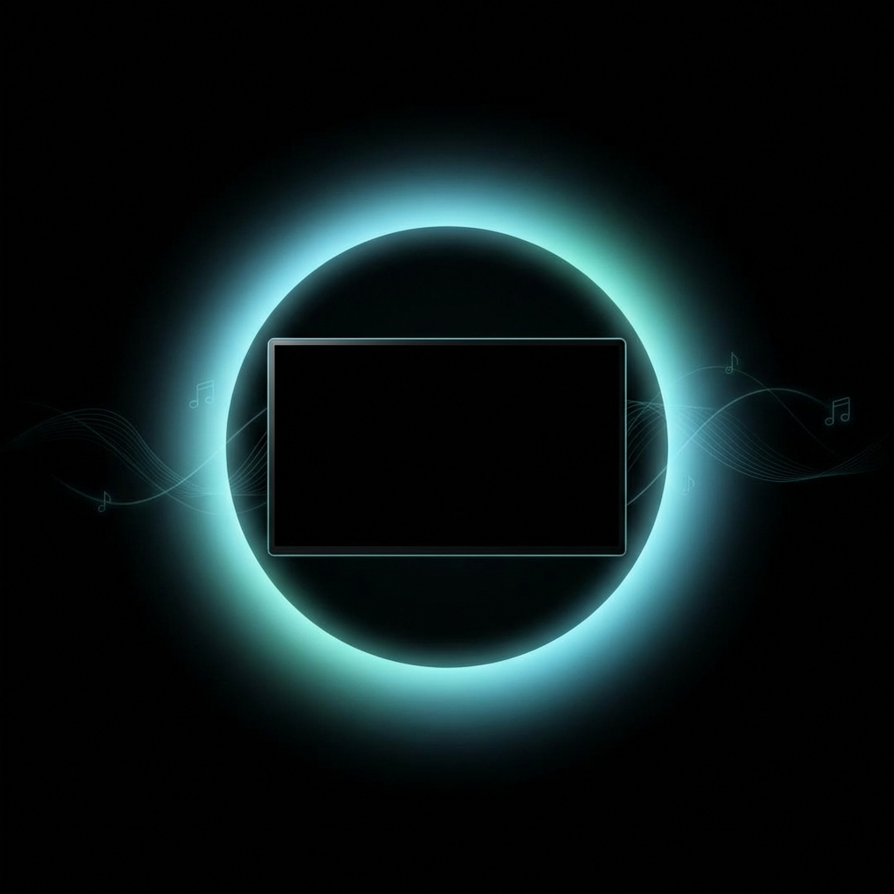

# Power-NAPS

**Not Another Protector of Screens** — Quick naps for your display. Instant wake. Maximum longevity.

  

---

## Why Power-NAPS?

Your screen is always on, slowly aging. Windows power management is unreliable — Chrome tabs, music apps, and background processes keep your display awake even when you're not there.

**Power-NAPS** gives your screen quick power naps:
- **⚡ Instant wake** — Unlike Windows screen-off (which takes seconds to reconnect), Power-NAPS wakes instantly
- **💰 Lower electricity bills** — Black pixels = zero power on OLED; reduced backlight on LCD
- **🖥️ Extended screen lifespan** — Less burn-in risk on OLED, less backlight wear on LCD
- **🔌 No hardware interruption** — USB devices, HDMI-ARC audio, and peripherals stay connected

### The Power Nap Philosophy

Just like a quick power nap refreshes you without the grogginess of deep sleep, Power-NAPS puts your screen into a light "nap" state:
- **Quick energy recharge** — Screen rests, pixels off
- **Instantly back on your feet** — No HDMI handshake delays, no reconnection lag  
- **All for longevity** — Your screen (and electricity bill) will thank you

---

## The Story

I bought a new OLED monitor. Having experienced burn-in on a TV before, I was very wary.

**What I quickly discovered:**
- ❌ Windows power settings are unreliable — Chrome, Spotify, and background apps send wake requests
- ❌ When Windows *does* turn off the screen, my HDMI-ARC audio (Sonos) disconnects
- ❌ Hiding the taskbar and rotating wallpapers doesn't actually prevent burn-in — it just avoids *visible* patterns while still accelerating overall panel wear
- ❌ My monitor had no built-in protection against accidentally staying on for days

**I searched for third-party solutions.** Every app I found had shortcomings:
- Some killed my audio connection
- Some could be accidentally closed
- Some didn't detect *physical* input, just any software activity
- None had proper resilience

**So I built Power-NAPS.** You can't even close it by accident — the watchdog brings it right back.

---

## 🇬🇧 Features

| Feature | Description |
|---------|-------------|
| 🖥️ **Works on Any Screen** | OLED, LCD, gaming monitors — all benefit from reduced on-time |
| ⚡ **Instant Wake** | No Windows reconnection delay — wake up in milliseconds |
| 💰 **Saves Electricity** | OLED: black = off. LCD: reduced backlight aging |
| 🔌 **Hardware Stays Connected** | USB hubs, HDMI-ARC speakers, webcams — nothing disconnects |
| ⏱️ **Configurable Timer** | 5, 10, 15, 30, or 60 minutes of inactivity |
| 🎯 **Smart Wake Triggers** | Mouse, keyboard, gamepad, microphone, or schedule |
| 🖥️ **Remote Control Mode** | NEW: Stay dark during RDP/TeamViewer sessions |
| 🔄 **Auto-Start Watchdog** | Always running, even after crashes |

### Hotkeys

| Hotkey | Action |
|--------|--------|
| `Alt + P` | Instant nap (screen goes dark, everything stays connected) |
| `Alt + Shift + P` | Deep sleep (hardware standby for OLED Pixel Refresh) |
| `Escape` | Wake up immediately |
| `Ctrl + Alt + Scroll` | Adjust darkness level on-the-fly |

---

## Installation

1. Download `PowerNAPS-v2.4.zip` from [Releases](https://github.com/Emis-Dev/NAOLEDP/releases)
2. Extract and double-click **`Install.exe`**
3. Done! Power-NAPS protects your screen.

Right-click the tray icon to configure timer, wake triggers, and more.

---

## 🇳🇱 Nederlands

### Waarom Power-NAPS?

Je scherm staat altijd aan en veroudert langzaam. Windows energiebeheer is onbetrouwbaar — Chrome tabs, muziek-apps en achtergrondprocessen houden je scherm wakker, zelfs als je er niet bent.

**Power-NAPS** geeft je scherm snelle power naps:
- **⚡ Direct wakker** — Anders dan Windows scherm-uit (wat seconden duurt om opnieuw te verbinden), wordt Power-NAPS direct wakker
- **💰 Lagere elektriciteitsrekening** — Zwarte pixels = geen stroom op OLED; verminderde achtergrondverlichting op LCD
- **🖥️ Langere levensduur scherm** — Minder inbrandrisico op OLED, minder slijtage achtergrondverlichting op LCD
- **🔌 Geen hardware onderbreking** — USB apparaten, HDMI-ARC audio en randapparatuur blijven verbonden

### Kenmerken

| Kenmerk | Beschrijving |
|---------|--------------|
| 🖥️ **Werkt op Elk Scherm** | OLED, LCD, gaming monitoren — allemaal profiteren van minder aan-tijd |
| ⚡ **Direct Wakker** | Geen Windows reconnectie vertraging — in milliseconden wakker |
| 💰 **Bespaart Elektriciteit** | OLED: zwart = uit. LCD: verminderde slijtage achtergrondverlichting |
| 🔌 **Hardware Blijft Verbonden** | USB hubs, HDMI-ARC speakers, webcams — niets wordt losgekoppeld |
| ⏱️ **Instelbare Timer** | 5, 10, 15, 30 of 60 minuten inactiviteit |
| 🎯 **Slimme Wake Triggers** | Muis, toetsenbord, gamepad, microfoon of schema |
| 🖥️ **Remote Control Modus** | NIEUW: Blijf donker tijdens RDP/TeamViewer sessies |
| 🔄 **Auto-Start Watchdog** | Altijd draaiend, zelfs na crashes |

### Sneltoetsen

| Sneltoets | Actie |
|-----------|-------|
| `Alt + P` | Directe nap (scherm gaat donker, alles blijft verbonden) |
| `Alt + Shift + P` | Diepe slaap (hardware standby voor OLED Pixel Refresh) |
| `Escape` | Direct wakker worden |
| `Ctrl + Alt + Scroll` | Donkerheid aanpassen |

### Installatie

1. Download `PowerNAPS-v2.4.zip` van [Releases](https://github.com/Emis-Dev/NAOLEDP/releases)
2. Uitpakken en dubbelklik op **`Install.exe`**
3. Klaar! Power-NAPS beschermt je scherm.

---

## Technical Details

Power-NAPS is built with AutoHotkey v2 — a single portable executable with no dependencies.

### How It Works

1. **Physical Idle Detection** — Uses `A_TimeIdlePhysical` to detect real user input, ignoring software wake requests
2. **Black Overlay** — Instead of hardware standby, creates a fullscreen black window (OLED pixels = off)
3. **Remote Session Detection** — Automatically detects RDP/TeamViewer and ignores remote input
4. **Instant Recovery** — No HDMI re-handshake needed, wake is instant

### Why Not Just Use Windows Screen Saver?

| | Windows Screen Off | Power-NAPS |
|-|-------------------|------------|
| Wake time | 2-5 seconds | **Instant** |
| USB devices | Disconnect/reconnect | **Stay connected** |
| HDMI-ARC audio | Handshake breaks | **Keeps playing** |
| Reliable trigger | No (software can prevent) | **Yes (physical only)** |

---

## License

MIT License — See [LICENSE](LICENSE) for details.

---

  <strong>Power-NAPS</strong> — Not Another Protector of Screens 
  Quick naps. Instant wake. Maximum longevity.  
  Made with ❤️ for everyone who wants their screen to last longer.

