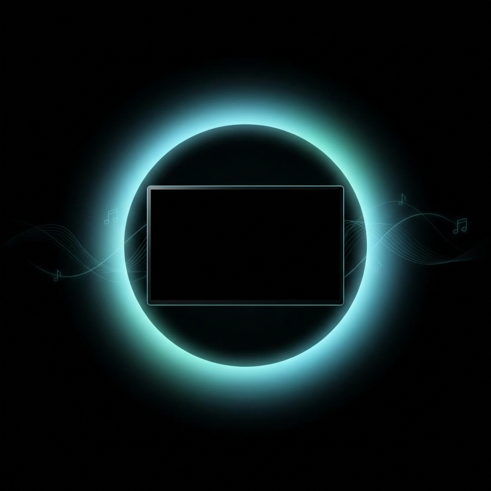

# Power-NAPS

**Not Another Protector of Screens** — Quick naps for your display. Instant wake. Maximum longevity.

  

---

## Why Power-NAPS?

Your screen is always on, slowly aging. Windows power management is unreliable — Chrome tabs, music apps, and background processes keep your display awake even when you're not there.

**Power-NAPS** gives your screen quick power naps:
- **⚡ Instant wake** — Unlike Windows screen-off (which takes seconds to reconnect), Power-NAPS wakes instantly
- **💰 Lower electricity bills** — Black pixels = zero power on OLED; reduced backlight on LCD
- **🖥️ Extended screen lifespan** — Less burn-in risk on OLED, less backlight wear on LCD
- **🔌 No hardware interruption** — USB devices, HDMI-ARC audio, and peripherals stay connected

### The Power Nap Philosophy

Just like a quick power nap refreshes you without the grogginess of deep sleep, Power-NAPS puts your screen into a light "nap" state:
- **Quick energy recharge** — Screen rests, pixels off
- **Instantly back on your feet** — No HDMI handshake delays, no reconnection lag  
- **All for longevity** — Your screen (and electricity bill) will thank you

---

## 🇬🇧 Features

| Feature | Description |
|---------|-------------|
| 🖥️ **Works on Any Screen** | OLED, LCD, gaming monitors — all benefit from reduced on-time |
| ⚡ **Instant Wake** | No Windows reconnection delay — wake up in milliseconds |
| 💰 **Saves Electricity** | OLED: black = off. LCD: reduced backlight aging |
| 🔌 **Hardware Stays Connected** | USB hubs, HDMI-ARC speakers, webcams — nothing disconnects |
| ⏱️ **Configurable Timer** | 5, 10, 15, 30, or 60 minutes of inactivity |
| 🎯 **Smart Wake Triggers** | Mouse, keyboard, gamepad, microphone, audio output |
| ⏰ **Schedule Mode** | Disable naps during work hours |
| 🔄 **Remote Wake Cooldown** | Prevents flashing when using remote desktop (v3.3) |
| 🔄 **Auto-Start Watchdog** | Always running, even after crashes |

### Hotkeys

| Hotkey | Action |
|--------|--------|
| `Alt + P` | Instant nap (screen goes dark, everything stays connected) |
| `Alt + Shift + P` | Turn monitor off (hardware standby for OLED Pixel Refresh) |
| `Escape` | Wake up immediately |
| `Ctrl + Alt + Scroll` | Adjust darkness level on-the-fly |

---

## Installation

1. Download `PowerNAPS-v3.3.zip` from [Cloudflare](https://tom.cool)
2. Extract and double-click **`Install.exe`**
3. Done! Power-NAPS protects your screen.

Right-click the tray icon to configure timer, wake triggers, and more.

---

## 🇳🇱 Nederlands

### Waarom Power-NAPS?

Je scherm staat altijd aan en veroudert langzaam. Windows energiebeheer is onbetrouwbaar — Chrome tabs, muziek-apps en achtergrondprocessen houden je scherm wakker, zelfs als je er niet bent.

**Power-NAPS** geeft je scherm snelle power naps:
- **⚡ Direct wakker** — Anders dan Windows scherm-uit, wordt Power-NAPS direct wakker
- **💰 Lagere elektriciteitsrekening** — Zwarte pixels = geen stroom op OLED
- **🖥️ Langere levensduur scherm** — Minder inbrandrisico op OLED, minder slijtage op LCD
- **🔌 Geen hardware onderbreking** — USB apparaten, HDMI-ARC audio blijven verbonden

### Kenmerken

| Kenmerk | Beschrijving |
|---------|--------------|
| 🖥️ **Werkt op Elk Scherm** | OLED, LCD, gaming monitoren — allemaal profiteren |
| ⚡ **Direct Wakker** | Geen reconnectie vertraging — in milliseconden wakker |
| 💰 **Bespaart Elektriciteit** | OLED: zwart = uit. LCD: minder slijtage |
| 🔌 **Hardware Blijft Verbonden** | USB hubs, HDMI-ARC speakers blijven verbonden |
| ⏱️ **Instelbare Timer** | 5, 10, 15, 30 of 60 minuten inactiviteit |
| 🎯 **Slimme Wake Triggers** | Muis, toetsenbord, gamepad, microfoon |
| ⏰ **Schema Modus** | Schakel naps uit tijdens werkuren |
| 🔄 **Remote Wake Cooldown** | Voorkomt flikkeren bij remote desktop (v3.3) |
| 🔄 **Auto-Start Watchdog** | Altijd draaiend, zelfs na crashes |

### Sneltoetsen

| Sneltoets | Actie |
|-----------|-------|
| `Alt + P` | Directe nap (scherm gaat donker, alles blijft verbonden) |
| `Alt + Shift + P` | Monitor uitzetten (hardware standby voor OLED Pixel Refresh) |
| `Escape` | Direct wakker worden |
| `Ctrl + Alt + Scroll` | Donkerheid aanpassen |

### Installatie

1. Download `PowerNAPS-v3.3.zip` van [Cloudflare](https://tom.cool)
2. Uitpakken en dubbelklik op **`Install.exe`**
3. Klaar! Power-NAPS beschermt je scherm.

---

## Technical Details

Power-NAPS is built with AutoHotkey v2 — a single portable executable with no dependencies.

### How It Works

1. **Physical Idle Detection** — Uses `A_TimeIdlePhysical` to detect real user input, ignoring software wake requests
2. **Black Overlay** — Instead of hardware standby, creates a fullscreen black window (OLED pixels = off)
3. **Cooldown Timer** — After any wake event, enforces full timer duration before reactivating (v3.3)
4. **Instant Recovery** — No HDMI re-handshake needed, wake is instant

### v3.3 Changes (Feb 2026)

- **Fixed remote wake loop** — Global change to A_TimeIdle fixes countdown bug over remote inputs
- **Remove Old Watchdog/Tasks** — Installer cleans up NAOLEDP and older traces.
- **Fixed remote wake flashing** — Added cooldown timer to prevent immediate reactivation after remote input
- **Removed RDP detection logic** — Remote keyboard/mouse now treated as standard wake triggers
- **Renamed "Hardware Standby" to "Turn Monitor Off"** — Clearer naming

### Why Not Just Use Windows Screen Saver?

| | Windows Screen Off | Power-NAPS |
|-|-------------------|------------|
| Wake time | 2-5 seconds | **Instant** |
| USB devices | Disconnect/reconnect | **Stay connected** |
| HDMI-ARC audio | Handshake breaks | **Keeps playing** |
| Reliable trigger | No (software can prevent) | **Yes (physical only)** |

---

## License

MIT License — See [LICENSE](LICENSE) for details.

---

  <strong>Power-NAPS</strong> — Not Another Protector of Screens 
  Quick naps. Instant wake. Maximum longevity.  
  Made with ❤️ for everyone who wants their screen to last longer.

